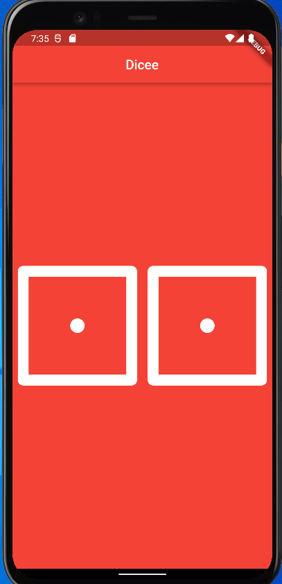

# dicee
This app number of the flutter bootcamp

Giving an application functionality through the use of Dart and working with Expanded Widget

Dart Functions

e.g. 
void getMilk() {
    //do something
}

() {//do something} -> this is an Anonymous function

Void Callback -> anonymous function

String Interpolation 

var myName = 'Selp';

print(myName);

Dart Datatypes
-------------------------------------------------------
Dart is statically typed language
Strings
Int
Double
Bool
The above are all the Primitive Datatyes in Dart
Dynamic Typed Languages and Statically Typed Languages

Stateless and Stateful
------------------------

